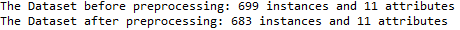
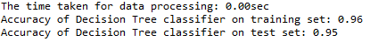
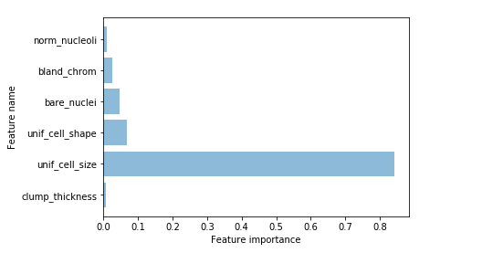

# Decision Tree

In this project decision tree is used to predict benign or malignant for breast cancer.

Tasks Performed :
1. Preparation of Database
2. Splitting the data into training and test sets with the ratio of 80 and 20 respectively
3. Calculating the processing time and accuracy of the sets 
4. Getting the important features and plotting them

## Attribute information

   Attribute                       Domain
   -- -----------------------------------------
   1. Sample code number            100003
   2. Clump Thickness               1 - 10
   3. Uniformity of Cell Size       1 - 10
   4. Uniformity of Cell Shape      1 - 10
   5. Marginal Adhesion             1 - 10
   6. Single Epithelial Cell Size   1 - 10
   7. Bare Nuclei                   1 - 10
   8. Bland Chromatin               1 - 10
   9. Normal Nucleoli               1 - 10
  10. Mitoses                       1 - 10
  11. Class:                        (2 for benign, 4 for malignant)
  
##Step by Step

```python

from sklearn.externals.six import StringIO  
from sklearn.cross_validation import train_test_split
from sklearn.tree import DecisionTreeClassifier
from sklearn import tree
import pydotplus
import matplotlib.pyplot as plt
import pandas as pd
import numpy as np
import time

'''Reading the file and preperation of data '''

df=pd.read_csv("breast-cancer-wisconsin.txt")
df2 = df.replace({'?':np.nan}).dropna()
d=df2.columns[:-1]

print("The Dataset before preprocessing: %s instances and %s attributes"% (df.shape[0],df.shape[1]))
print("The Dataset after preprocessing: %s instances and %s attributes"% (df2.shape[0],df2.shape[1]))
```



```python
'''Training the data and calculate the process time '''

X = np.array(df2.drop(['class_type'],1))
y = np.array(df2['class_type'])

X_train, X_test, y_train, y_test = train_test_split( X, y,test_size=0.2,random_state = 0)
start_time = time.clock()
clf_gini = DecisionTreeClassifier(max_depth = 3, random_state = 0).fit(X_train, y_train)
end_time = time.clock()
time_taken = end_time - start_time
print ('The time taken for data processing: {:.2f}sec'.format(time_taken))

'''Calculating the accuracy of trained sets'''

print('Accuracy of Decision Tree classifier on training set: {:.2f}'
     .format(clf_gini.score(X_train, y_train)))
print('Accuracy of Decision Tree classifier on test set: {:.2f}'
    .format(clf_gini.score(X_test, y_test))) 
```



```python
'''Listing important features and remove the ones with 0 importance'''

feature = list(zip(map(lambda x: round(x, 4), clf_gini.feature_importances_), d))

imp_names = []
imp_values = []
for i in feature:
    if i[0] != 0.0:
        imp_names.append(i[1])
        imp_values.append(i[0])
    else:
        pass    

'''Plotting the important features''' 
       
length = np.arange(len(imp_names))
plt.barh(length, imp_values, align='center', alpha=0.5)
plt.yticks(length, imp_names)
plt.ylabel('Feature name')
plt.xlabel('Feature importance')
plt.show()
```



```python
'''Plotting the decision tree with max depth = 3'''

dot_data=StringIO()
tree.export_graphviz(clf_gini, out_file = dot_data, 
    feature_names=d, class_names=['Benign','Malignant'], 
    filled=True, rounded=True, special_characters=True) 
graph = pydotplus.graph_from_dot_data(dot_data.getvalue())
graph.write_png("my_tree.png")
plt.show()
```


## About Used Dataset(Reference)
   This breast cancer databases was obtained from the University of Wisconsin
   Hospitals, Madison from Dr. William H. Wolberg. 
   Title: Wisconsin Breast Cancer Database (January 8, 1991)
   
   Link : https://archive.ics.uci.edu/ml/datasets/Breast+Cancer+Wisconsin+%28Original%29